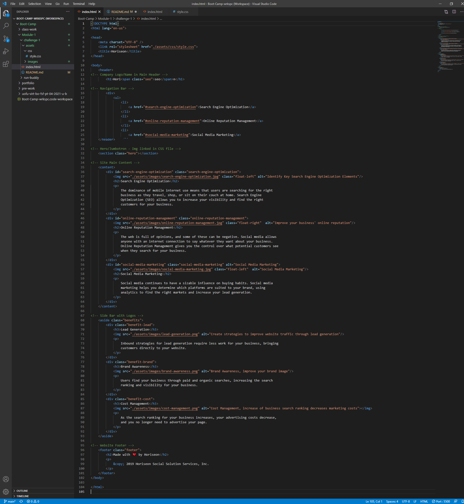

# challenge-1
## Description
Challenged to refactor website of improved website accessibility for search engines and developers. 

## Challenge Link
[Access the Challenge Here](https://jbped.github.io/challenge-1/)

### Actions Taken:
1. Got rid of that div soup and used more appropriate symantic tags to make the page more digestable for browsers and accessibility programs. This included refactoring the CSS stylesheet to match the changes made in the HTML file without effecting the displayed stylization of the page.

2. Reorganized CSS elements to be clustered with other assoicated elements.

3. Added comments to HTML and CSS for clearer sections

4. Corrected div without correct class that was being referenced in the navbar anchor

5. Added alt attributes to each image

## Images

**Image of HTML**

